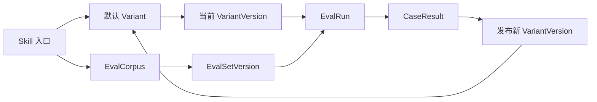

# SkillHub MVP Spec

本文档固化当前 demo 已经跑通的产品和工程契约。它不是最终架构，也不是市场叙事；它的作用是让后续实现不再反复摇摆。

字段级 API 契约以 [`api-contract.md`](./api-contract.md) 为准；更早的设计推演保留在 [`mvp-design-spec.md`](./mvp-design-spec.md)。

## 1. 当前结论

SkillHub MVP 要证明的不是“可以上传和下载 skill”，而是：

```text
一个可分发的 skill 变体，能被测评集持续验证，并能通过版本迭代留下可复现的收益证据。
```

当前 demo 已经验证的最小闭环：



这个闭环里，分发只是表层。平台真正保存的是引用、版本、测评集、测评结果和变更证据。

## 2. 已验证用例

当前 demo 已经跑通过两个不同 skill 的流程，其中 `security-reviewer` 是新增 skill 的回归用例：

| 对象 | 当前状态 |
| --- | --- |
| `Skill` | `security-reviewer` |
| 默认 `Variant` | `Variant A / Security baseline` |
| tags | `codex`, `security` |
| 当前 `VariantVersion` | `v2` |
| 当前 `EvalSetVersion` | `v3` |
| cases | 2 |
| 当前结果 | 2 通过 / 0 不通过 / 0 未测，100% |

两条 case 分别覆盖：

- 敏感 token 被输出到错误响应。
- 管理接口缺少 `ownerId` 校验。

这条回归用例证明：新增一个完全不同的 skill 后，首页浏览、skill 页面、测评集、手工测评、发布版本、结果详情都能串起来。

## 3. 核心模型

### Skill

`Skill` 是稳定入口，不是最终内容。

职责：

- 提供 hub 上可搜索、可打开、可安装的入口。
- 指向默认 `Variant`。
- 承载 owner/namespace 等权限相关引用。

关键字段：

- `id`
- `slug`
- `owner_ref`
- `default_variant_ref`
- `created_at`

规则：

- MVP 中一个 `Skill` 对应一个 `EvalCorpus`。
- 用户在 hub 看到的是 skill，但实际安装和测评的是默认 variant。
- `Skill` 本身不保存 skill 内容。

### Variant

`Variant` 是分发单位，表示维护者在某组 tags 约束下认可的当前解。

职责：

- 被用户安装。
- 被测评和比较。
- 维护自己的当前版本指针。

关键字段：

- `id`
- `skill_ref`
- `name`
- `label`
- `summary`
- `tag_set_ref`
- `current_version_ref`
- `created_at`

规则：

- variant 不是自动计算出来的“最佳结果”，而是人为创建和更新的对象。
- tags 只表达约束集合，例如 `codex`、`gpt5.4`、`opencode`、`minimax2.7`、`security`。
- 同一 variant 的更新通过新建 `VariantVersion` 表达。
- variant 之间不表达 parent/child 血缘。fork、PR、协作来源后续再做。

### VariantVersion

`VariantVersion` 是不可变内容快照。

职责：

- 固定某一时刻的 skill 内容。
- 作为 EvalRun 的被测对象。
- 支撑历史版本查看和回归复测。

关键字段：

- `id`
- `variant_ref`
- `version`
- `content_ref`
- `change_note`
- `created_at`

规则：

- append-only，不原地修改。
- 发布新版本只移动 `Variant.current_version_ref`。
- 旧 EvalRun 仍绑定旧版本，不会因为 current pointer 移动而改变含义。
- 发布新版本后，当前版本需要重新 EvalRun，才能得到当前测评结果。

### EvalCase

`EvalCase` 是完整测试用例，不是检查项。

职责：

- 保存一个输入场景和期望输出。
- 作为测评集增长的基本资产。

关键字段：

- `id`
- `corpus_ref`
- `title`
- `source_type`
- `input_artifact_ref`
- `expectation_artifact_ref`
- `grader_ref`
- `expectation`
- `origin_ref`
- `created_at`

规则：

- MVP 先只看最终 pass/fail。
- MVP 中 `EvalCase` 视为不可变对象。修正 input 或 expected output 时，新建 `EvalCase` 并生成新的 `EvalSetVersion`，不要原地修改旧 case。
- 如果正式版需要“编辑 case 且保留历史”，模型升级为 `EvalCaseVersion`，让 `EvalSetVersion` 引用 case version，而不是引用可变 case。
- “遗漏空值检查”这类内容只能是 case 标题或期望说明，不能再形成一层复杂检查条件。
- bad case 不做独立中心模块；进入长期价值链路时必须转成 `EvalCase`。

### EvalSetVersion

`EvalSetVersion` 是 case 列表快照。

职责：

- 固定某次测评使用的 case 集合。
- 支撑不同 variant/version 在同一测评集版本上的可比性。

关键字段：

- `id`
- `corpus_ref`
- `version`
- `case_refs`
- `created_at`

规则：

- append-only。
- 新增 case 后自动生成新的 `EvalSetVersion`。
- 每个 `EvalSetVersion` 页面必须能查看它包含的具体 case 内容，而不只是 case 数量。
- 比较结果必须说明使用的是哪个 eval set version。

### EvalRun 和 CaseResult

`EvalRun` 绑定一次测评事实。

职责：

- 记录某个 `VariantVersion` 在某个 `EvalSetVersion` 上的执行结论。
- 保存测评策略引用和配置摘要。

关键字段：

- `EvalRun.variant_version_ref`
- `EvalRun.eval_set_version_ref`
- `EvalRun.strategy_ref`
- `EvalRun.run_config_hash`
- `EvalRun.status`
- `CaseResult.run_ref`
- `CaseResult.case_ref`
- `CaseResult.passed`
- `CaseResult.score`

规则：

- MVP 中 `CaseResult.passed` 是唯一核心判断。
- `score` 先用 `pass=1`、`fail=0`。
- 复杂报告、日志、模型输出、人工说明后续放 artifact，不阻塞 MVP。

## 4. 页面契约

当前前端 demo 保留 6 个视图。正式版可以重做交互和视觉，但这些信息入口不能丢。

| 视图 | 目的 | 必须能看到 |
| --- | --- | --- |
| Hub | 浏览和寻找所有 skill | slug、简介、tags、variant 数、case 数、默认通过率 |
| Variant Page | 查看一个 skill/variant | 当前版本、得分、测评集总览、结果总览、变体地图、历史版本 |
| Eval Corpus | 管理测评集 | eval set version、case 列表、各 variant 在 case 上的结果矩阵、添加 case |
| Eval Result | 查看结果详情 | variant/version、eval set version、总分、每条 case 的 pass/fail |
| Experiment | 手工实验 | 选择 variant、选择 variant version、选择 eval set version、确认每条 case pass/fail、保存 EvalRun、发布新版本 |
| Manage | 管理入口 | 创建 skill、更新 skill 元数据、创建 variant、更新 variant 简介 |

关键交互规则：

- 点击 hub 的 skill 进入同一个 Variant Page 模板。
- 点击 variant 地图节点仍然进入同一个 Variant Page 模板，只是切换 selected variant。
- 点击历史版本仍然留在同一个 Variant Page 模板，只是切换 selected version。
- Eval Corpus 和 Eval Result 是从 Variant Page 可进入的证据视图。
- Variant Page 必须能看到当前 `VariantVersion` 在各 `EvalSetVersion` 上的验证记录，避免只展示内容包而看不到证据。
- 新发布的 `VariantVersion` 在当前 `EvalSetVersion` 上没有 EvalRun 时，Variant Page 必须明确标出“需要测评”，并提供进入 Experiment 的入口。
- `skill_bundle` 版本不能只展示文件列表，Variant Page 必须展示该快照内每个文件的具体内容，至少包括 `SKILL.md` 和 references。
- `skill_bundle` 版本需要支持任意两个历史版本的文件 diff。MVP 从完整快照按需计算 diff，不把差异文件作为事实源存储。
- Eval Corpus 必须把 `EvalSetVersion` 选择、当前结果矩阵、测试用例库、添加 EvalCase 分开展示，避免把 case 和 result 混成一层。
- Experiment 必须显式展示本次测评绑定：`VariantVersion + EvalSetVersion`。保存 EvalRun 后，Result Page 必须按这个绑定展示，而不是按当前默认版本推断。

## 5. API 边界

当前 Python demo 后端提供最小可写 API：

| Endpoint | 作用 |
| --- | --- |
| `GET /api/state` | 返回完整 demo 对象图 |
| `GET /api/skills` | 返回 skill 列表摘要 |
| `GET /api/skill` | 返回 skill 详情 |
| `GET /api/variant-page` | 返回 Variant Page 所需数据 |
| `GET /api/eval-set` | 返回测评集详情 |
| `GET /api/eval-result` | 返回测评结果详情 |
| `POST /api/skills` | 创建 skill、默认 variant、初始 version、空 eval set |
| `PATCH /api/skills` | 更新 skill 元数据和默认 variant 指针 |
| `POST /api/variants` | 新建约束变体 |
| `PATCH /api/variants` | 更新 variant 元数据 |
| `POST /api/skill-bundles` | 导入标准 skill 文件夹快照并返回 ContentRef |
| `POST /api/eval-cases` | 添加 case 并生成新 EvalSetVersion |
| `POST /api/variant-versions` | 发布新 VariantVersion |
| `POST /api/eval-runs` | 保存 EvalRun 和 CaseResult |
| `POST /api/reset` | 将 demo 状态重置为 seed data |

前端写入原则：

- 所有 mutation 走 API。
- mutation 返回后从后端重新加载状态。
- 重新加载时必须保持当前 skill/variant/version/eval set 的一致选择，不能掉回第一个 skill。
- `EvalRun` 的 `VariantVersion` 和 `EvalSetVersion` 必须属于同一个 skill。

## 6. MVP 范围

必须保留：

- 新建 skill 的完整链路。
- 新建 variant 的完整链路。
- 新增 eval case 后生成新 eval set version。
- 手工 pass/fail 测评。
- 发布 variant version。
- 查看当前结果和逐 case 结果。
- 查看 variant 历史版本。
- Repository 持久化，默认 SQLite、可切回 JSON，能刷新后保留 demo 状态。
- Skill / Variant 支持 archive/deprecate，不做硬删除；Hub 默认隐藏 archived skill，direct link 仍可查。

明确暂不做：

- 硬删除。
- 完整权限管理。
- fork / branch / PR 协作流。
- 自动测评 runner。
- 自动升级器。
- LLM judge / rubric 细节。
- 多维查询表格。
- 正式前端交互和视觉。
- 真实 Git 内容存储。
- marketplace 排名和推荐。

这些不是不重要，而是不能抢 MVP 的主线。第一阶段先证明对象关系和状态流没有问题。

## 7. Git 和内容存储

当前结论：可以借鉴 Git，但核心模型不绑定 Git。

平台只要求 `VariantVersion.content_ref` 指向不可变内容：

- demo 阶段：`inline_bundle`
- 标准 skill 包：`skill_bundle`
- 早期正式版：本地 artifact 或对象存储
- 后续：Git commit、repo path、external repo revision

标准 skill 包不是单个 prompt 字段，而是一整个文件夹快照：

```text
skill-name/
  SKILL.md
  agents/openai.yaml
  scripts/
  references/
  assets/
```

其中 `SKILL.md` 是必需文件，包含 YAML frontmatter 的 `name` 和 `description` 以及正文说明；其他目录按需存在。平台数据库只保存 `content_ref`、摘要、归属关系和测评事实，不把每个文件拆成业务表字段。demo 后端已经把 bundle 内容放到 `ArtifactStore`，领域状态里只保留 artifact 元数据、hash 和 locator。

Git 适合承载：

- 内容 diff
- 回滚
- merge / PR
- fork 协作
- 文件级审查

平台负责承载：

- 哪个 variant 当前指向哪个版本
- 哪个版本在哪个 eval set 上跑过
- 每条 case 的结果是什么
- 哪次发布带来了什么指标变化

因此 Git 是内容层候选，不是产品模型本身。

MVP diff 策略：

- `ArtifactStore` 存储完整 `skill_bundle` 快照。
- diff 由两个 `VariantVersion.content_ref` 指向的快照按需计算。
- 当前 demo 用本地文件系统 artifact store；是否使用 Git object storage、对象存储、SQLite blob、文件系统目录或混合方案，放到正式技术栈选型阶段决策。

## 8. Demo 验收标准

一个 demo 版本只有满足以下条件，才算闭环：

- 从 Hub 能打开任意 skill。
- 新建一个不同 skill 后，不能污染已有 skill 的 eval corpus。
- 新增 case 后，页面仍停留在当前 skill 的 Eval Corpus。
- 保存 EvalRun 后，矩阵能显示每条 case 的 pass/fail。
- 发布新版本后，历史版本能看到新版本。
- 发布新版本后，旧 run 仍绑定旧 version。
- 对当前新版本重新 EvalRun 后，Variant Page 和 Eval Result 显示当前得分。
- URL 能表达当前页面和关键对象；刷新后仍能回到对应的 Skill / VariantVersion / EvalSetVersion / EvalRun 视图。
- 刷新页面后，后端 Repository 中的数据能恢复。

已跑通的回归样例：

```text
security-reviewer
  -> Variant A / Security baseline
  -> EvalSetVersion v3 / 2 cases
  -> VariantVersion v2
  -> EvalRun: 2 pass, 0 fail
```

## 9. 下一步

建议下一阶段只做三件事：

1. 把当前 demo 数据和接口整理成稳定 fixture，避免测试过程越跑越脏。
2. 给 Python 后端补一层领域级测试，覆盖“新增不同 skill 不串数据”的回归。
3. 基于本 spec 设计正式数据表或 SQLite 原型，不急着做复杂 UI。

前端正式化、权限、fork/PR、自动测评策略都应该等这三个完成后再展开。
