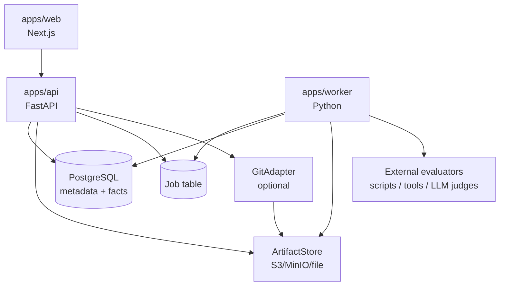
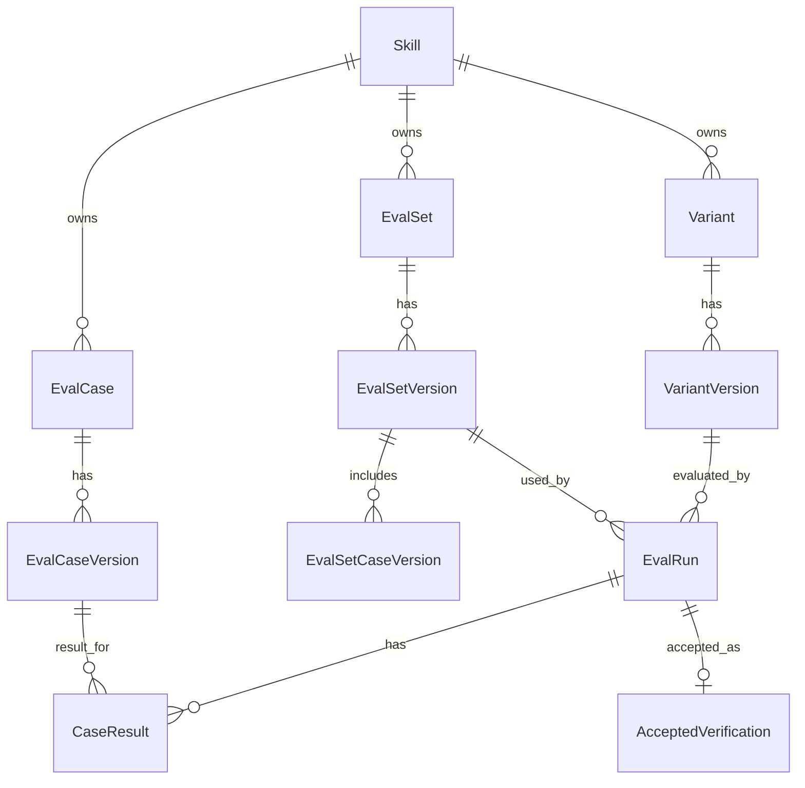
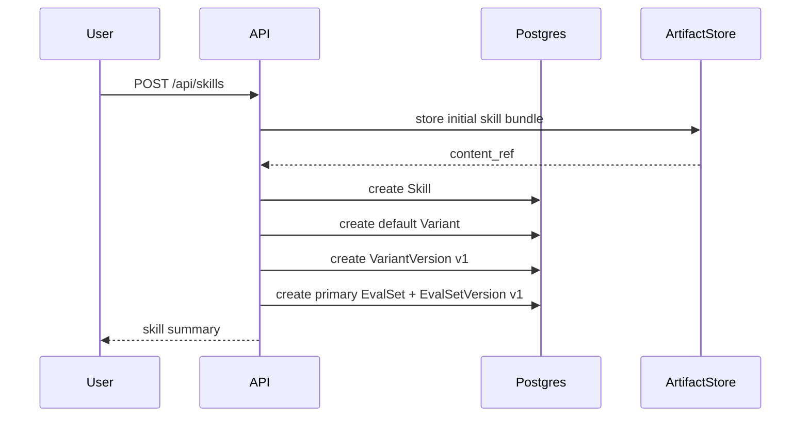
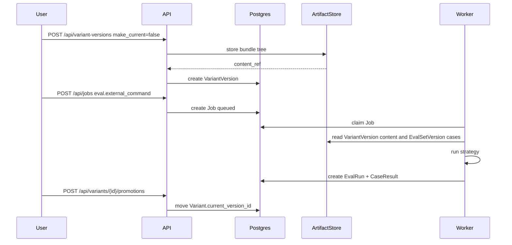
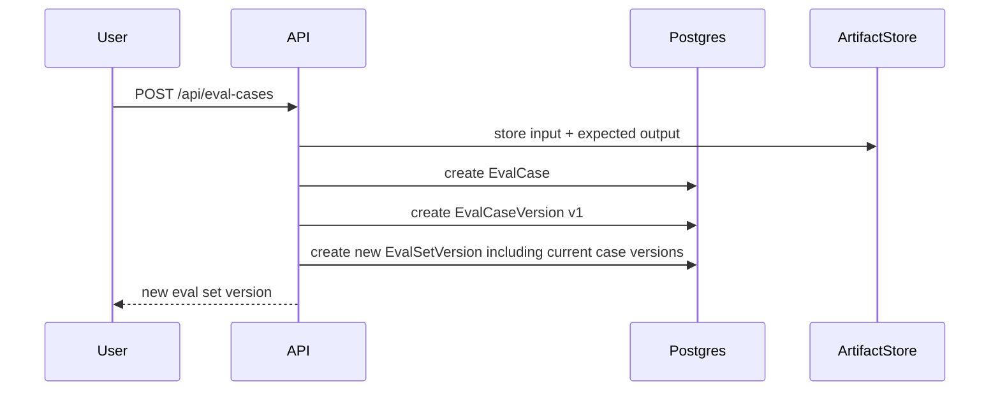

# SkillHub 正式版 v0.1 架构草案

本文档把 demo 已验证的模型收束成正式版 v0.1 的工程架构。它默认采用 [`formal-tech-stack.md`](./formal-tech-stack.md) 中的技术栈。

## 1. v0.1 产品目标

v0.1 不追求做完完整平台，而是把“可验证的 skill 分发”做成正式工程闭环：

```text
用户能创建标准 skill bundle，
维护不同 tags 约束下的 variant，
给 variant 发布不可变版本，
维护带版本的 eval set，
运行或导入测评结果，
最终在 Hub 和 Variant 页面看到可追溯的验证证据。
```

核心承诺：

- 分发入口简单，像普通 skillhub。
- 内部证据严谨，所有结果绑定精确版本。
- 内容存储可替换，Git 可以接入但不是前置依赖。
- 测评策略可插拔，平台先记录标准结果，再逐步执行更多策略。

## 2. 系统边界



边界规则：

- Web 不直接读数据库。
- Worker 不绕过领域服务写事实。
- ArtifactStore 不保存业务关系，只保存不可变内容。
- GitAdapter 不改变 `Skill / Variant / Eval` 模型，只提供内容树读写和 diff。

## 3. 领域对象

v0.1 继续沿用 demo 结论：



关键语义：

- `Skill` 是稳定入口。
- `Variant` 是某组 tags 下维护者认可的当前解。
- `VariantVersion` 是不可变内容快照。
- `EvalCase` 是稳定测试场景入口。
- `EvalCaseVersion` 是不可变测试用例快照。
- `EvalSetVersion` 是不可变 case version 列表快照。
- `EvalRun` 是一次 exact `VariantVersion + EvalSetVersion` 的证据。
- `CaseResult` 只记录该 run 下某个 case version 的最终结果。
- `AcceptedVerification` 是一个显式验证指针，说明某个 `Variant + EvalSetVersion` 当前认可哪一次不可变 `EvalRun`。

## 4. 数据所有权

### PostgreSQL

PostgreSQL 是事实源，负责：

- identity：所有对象 id。
- relationship：对象归属和引用。
- pointer：`default_variant_id`、`current_version_id`。
- immutable fact：version、eval set version、eval run、case result。
- permission：角色授权。
- job：异步任务状态。
- query index：Hub、Variant、Eval Run 页面所需读模型。

### ArtifactStore

ArtifactStore 是内容源，负责：

- 标准 skill 文件树。
- case input。
- expected output。
- eval import 原始 payload。
- eval report、日志、transcript。
- bundle diff 所需的不可变快照。

ArtifactStore locator 必须不可变。数据库保存：

- `artifact_id`
- `kind`
- `locator`
- `digest`
- `media_type`
- `size`
- `created_at`
- `created_by`

### GitAdapter

GitAdapter 只做内容协作：

- 把标准 skill 文件树写成 commit。
- 从 commit 读取文件树。
- 计算 commit/tree diff。
- 后续支持 fork/PR。

`VariantVersion.content_ref` 可以指向 Git commit，但不能指向 branch。

## 5. 模块结构

推荐 Python 后端结构：

```text
apps/api/skillhub/
  domain/
    models.py
    errors.py
    policies.py
  application/
    commands/
    queries/
    services/
  infrastructure/
    db/
    artifact_store/
    git_adapter/
    job_queue/
  api/
    routes/
    dependencies.py
```

模块职责：

| 模块 | 职责 |
| --- | --- |
| `domain` | 领域对象、不变量、权限规则，不依赖 FastAPI/SQLAlchemy |
| `application.commands` | 写入命令，例如 publish version、add case、record eval |
| `application.queries` | 页面读模型，例如 Hub summary、Variant page、Eval result |
| `infrastructure.db` | SQLAlchemy models、repositories、transactions |
| `infrastructure.artifact_store` | file/S3/MinIO artifact adapter |
| `infrastructure.git_adapter` | Git 内容适配器 |
| `infrastructure.job_queue` | job table enqueue/dequeue |
| `api.routes` | HTTP 边界、request/response schema |

Worker 复用 `domain`、`application`、`infrastructure`，但入口独立：

```text
apps/worker/skillhub_worker/
  main.py
  strategies/
    manual.py
    external_import.py
    external_command.py
```

## 6. API 形态

API 分两类：页面查询和命令写入。

### 页面查询

页面查询返回 denormalized view data，避免前端拼低层对象：

| Endpoint | 返回 |
| --- | --- |
| `GET /api/skills` | Hub 列表摘要 |
| `GET /api/skills/{skill_id}` | Skill 详情和默认 variant |
| `GET /api/variants/{variant_id}` | Variant Page 数据 |
| `GET /api/variants/{variant_id}/versions/{version_id}` | 同一 Variant Page，选中历史版本 |
| `GET /api/eval-sets/{eval_set_id}/versions/{version_id}` | Eval set version 详情和具体 case 内容 |
| `GET /api/eval-runs/{run_id}` | Eval run 详情和逐 case 结果 |
| `GET /api/eval-runs/compare` | 同一 EvalSetVersion 下两个 finished run 的修复/回退比较 |
| `GET /api/artifacts/{artifact_id}` | artifact 元数据 |
| `GET /api/artifacts/{artifact_id}/files` | skill bundle 文件树和内容 |
| `GET /api/artifacts/diff` | 两个 bundle 的 diff |

### 命令写入

命令接口要窄，语义明确：

| Endpoint | 命令 |
| --- | --- |
| `POST /api/skills` | 创建 skill、默认 variant、初始 version、主 eval set |
| `PATCH /api/skills/{skill_id}` | 更新 skill 元数据和默认 variant 指针 |
| `POST /api/variants` | 创建 tags 约束 variant 和初始 version |
| `PATCH /api/variants/{variant_id}` | 更新 variant 元数据 |
| `POST /api/variant-versions` | 创建不可变 version，可选择是否 make current |
| `POST /api/eval-cases` | 创建 case 和 case version，并生成新 eval set version |
| `POST /api/eval-case-versions` | 修正 case 内容，生成新 case version 和 eval set version |
| `POST /api/eval-runs` | 记录手工 pass/fail run |
| `POST /api/eval-runs/accepted-verifications` | 把一次 finished run 接受为当前验证依据 |
| `POST /api/eval-result-imports` | 导入外部标准结果 |
| `POST /api/jobs` | 创建外部策略执行 job |
| `POST /api/variants/{variant_id}/promotions` | 将 current_version_id 指向已有 version |

## 7. 核心流程

### 创建 Skill



### 发布候选版本并测评

注意：候选版本也是普通 `VariantVersion`，只是不一定是 current。



### 添加 Eval Case



## 8. 不变量

正式版必须用代码和数据库约束共同保证：

- `VariantVersion` 创建后不更新内容字段。
- `EvalCaseVersion` 创建后不更新 input/expected 字段。
- `EvalSetVersion` 创建后不更新 membership。
- `EvalRun` finished 后不改 `variant_version_id`、`eval_set_version_id`、`strategy`。
- `CaseResult` 不原地重写；重跑生成新的 `EvalRun`。
- `Variant.current_version_id` 只能指向同一 variant 下的 version。
- `Skill.default_variant_id` 只能指向同一 skill 下的 variant。
- `EvalRun.variant_version_id` 和 `EvalRun.eval_set_version_id` 必须属于同一个 skill。
- `EvalSetVersion.case_version_ids` 必须能还原完整 case 内容。
- Artifact digest 必须和读取内容一致。

## 9. 权限模型

v0.1 可以先单用户，但表结构按 scoped role 设计：

```text
subject_type + subject_id + resource_type + resource_id + role
```

角色：

- `owner`
- `maintainer`
- `evaluator`
- `viewer`

资源：

- `workspace`
- `skill`
- `variant`
- `eval_set`
- `artifact_namespace`

权限规则：

| 动作 | 需要 |
| --- | --- |
| 创建 skill | workspace maintainer |
| 创建 variant | skill maintainer |
| 创建 variant version | variant maintainer |
| promote version | variant maintainer |
| 添加 eval case | skill maintainer |
| 运行 eval | evaluator |
| 读 artifact | viewer 或 artifact namespace 权限 |
| archive/restore | maintainer |

## 10. 表设计草案

这里只定义 v0.1 的主表，不展开所有索引。

| 表 | 说明 |
| --- | --- |
| `skills` | hub 入口 |
| `tag_sets` | 规范化 tags 集合 |
| `variants` | tags 约束下的维护对象 |
| `variant_versions` | 不可变 skill 内容版本 |
| `eval_sets` | skill 的测评集入口 |
| `eval_set_versions` | 不可变 case version 列表 |
| `eval_cases` | 稳定测试场景 |
| `eval_case_versions` | 不可变测试用例 |
| `eval_set_case_versions` | eval set version 与 case version 的有序关联 |
| `eval_runs` | 一次测评事实 |
| `case_results` | 单 case 结果 |
| `artifacts` | artifact 元数据和 locator |
| `jobs` | worker 异步任务 |
| `role_assignments` | scoped 权限 |
| `audit_events` | 关键写操作审计 |

### 强约束建议

- `tag_sets.normalized_hash` 唯一。
- `variant_versions(variant_id, version_number)` 唯一。
- `eval_case_versions(case_id, version_number)` 唯一。
- `eval_set_versions(eval_set_id, version_number)` 唯一。
- `case_results(run_id, case_version_id)` 唯一。
- append-only 表避免普通 update path，必要字段通过数据库 trigger 或应用层 policy 保护。

## 11. 读模型

读模型先用 SQL view 或 application query 生成，不急着物化。

需要的页面读模型：

| 读模型 | 服务页面 |
| --- | --- |
| `HubSkillSummary` | Hub |
| `VariantPageView` | Variant Page |
| `EvalSetVersionView` | Eval Set Version |
| `EvalRunView` | Eval Run |
| `ManagementWorkspaceView` | 管理台 |

Hub 的 verification summary 必须显式：

```text
default variant current version
+ primary eval set current version
+ latest accepted run
+ strategy
+ timestamp
+ pass/fail counts
```

不要再显示含义模糊的 `latest score`。

## 12. 从 demo 迁移

迁移分三步：

1. 保留 demo 作为产品模型验证器，不继续美化。
2. 在正式目录搭 `apps/api`，用 demo fixture 写领域测试。
3. 等正式 API 跑通后，再搭 `apps/web`，只实现核心 5 页。

建议迁移顺序：

```text
contracts/schema
  -> domain model
  -> Postgres schema
  -> artifact store
  -> commands
  -> queries
  -> worker strategies
  -> web pages
```

demo 中值得保留的东西：

- API 契约。
- seed fixtures。
- 外部 eval import schema。
- external command runner 思路。
- skill bundle 文件树展示和 diff 思路。

demo 中不值得迁移的东西：

- 单页 UI 布局。
- SQLite snapshot 写法。
- 前端聚合领域对象的方式。
- demo-only reset。

## 13. v0.1 验收标准

正式 v0.1 只要满足以下标准，就算第一阶段闭环：

- 创建一个标准 skill bundle。
- 创建至少两个不同 skill，数据不串。
- 每个 skill 能创建多个 tags variant。
- 每个 variant 能创建多个 immutable version。
- 每个 skill 能添加 eval case，并生成新的 eval set version。
- Eval set version 页面能看到当时每条 case 的具体 input/expected。
- 能选择某个 `VariantVersion + EvalSetVersion` 手工记录测评。
- 能用外部命令策略生成测评结果。
- Eval Run 页面能看到每条 case 的 pass/fail。
- Variant Page 能看到历史版本和当前版本的验证状态。
- 未测评的新版本明确显示为未验证。
- 能把已有 candidate version promote 成 current。
- 所有核心写操作有领域测试。

## 14. 后续版本

v0.2：

- Git-backed artifact adapter。
- 更好的 diff/review 页面。
- 多维表格查询。
- 更完整权限 UI。

v0.3：

- ChangeProposal。
- fork/PR 协作。
- script runner sandbox。
- LLM judge strategy。

v0.4：

- upgrade agent。
- 自动生成 candidate version。
- 多策略对比和 promotion 建议。
