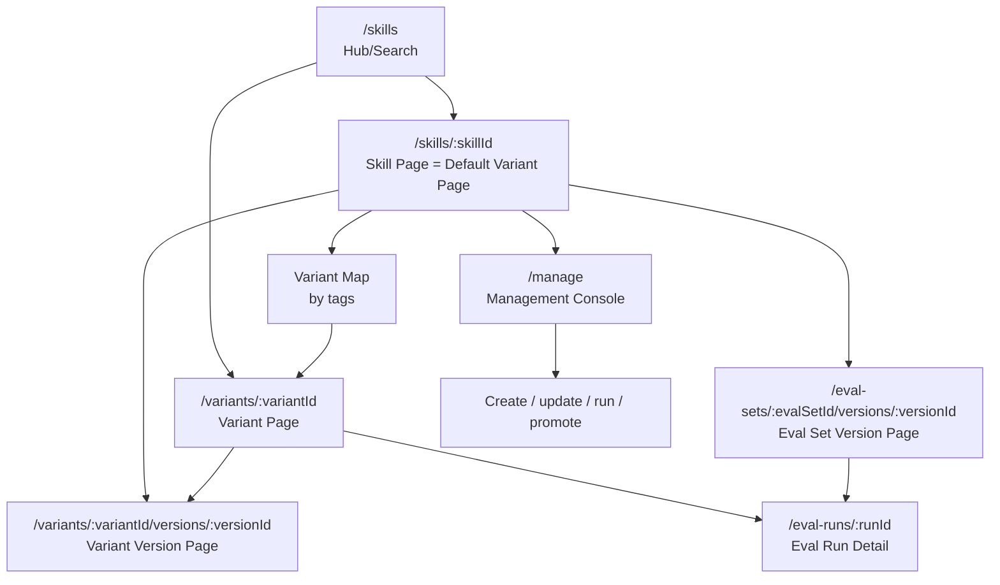
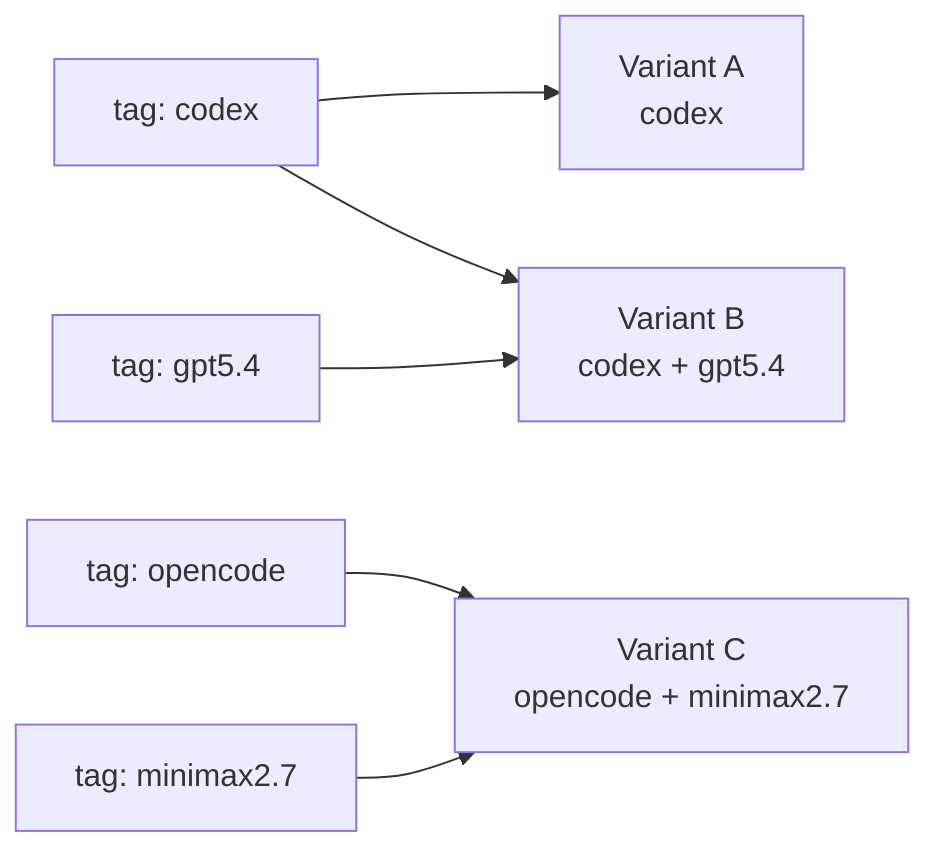

# SkillHub 正式版 UI 设计规格 v0.1

本文档定义正式版 UI 的产品结构和页面契约。目标不是美化当前 demo，而是为正式 Next.js 前端提供清晰的信息架构：普通用户看到的是一个好用的 SkillHub，高级用户可以一路钻到 variant version、eval set version、eval run 和 case result 的证据链。

## 1. 设计结论

正式 UI 采用“双层产品”：

```text
上层：普通 SkillHub
用户能搜索、浏览、打开 skill，看到它是做什么的、默认版本是什么、是否验证过。

下层：Skill 实验平台
维护者能管理 variant、version、eval set、case、eval run，并用证据决定是否 promotion。
```

核心原则：

- `Skill` 是 Hub 入口，默认指向一个 `Variant`。
- `Variant` 是某组 tags 约束下维护者认可的解。
- `VariantVersion` 是不可变内容快照。
- `EvalSetVersion` 是不可变测试集快照。
- `EvalRun` 是 exact `VariantVersion + EvalSetVersion` 的一次结果。
- UI 不展示 parent/child 族谱，因为 variant 没有血缘关系；只展示 tags 约束空间和各自历史版本。
- bad case 不作为一级对象；它进入 eval case 后才成为平台证据。
- 首页不做“推荐算法”；显示默认 variant 的显式验证摘要。

## 2. 信息架构



页面解释：

| 页面 | 用途 | 主要用户 |
| --- | --- | --- |
| Hub/Search | 找 skill，像主流 skillhub 一样浏览 | 使用者 |
| Skill Page | 解释 skill 用途，默认展示 default variant | 使用者、维护者 |
| Variant Page | 展示某个 tags 组合下的当前解和证据 | 使用者、维护者 |
| Variant Version Page | 展示历史版本内容、变更摘要、该版本测评 | 维护者 |
| Eval Set Version Page | 展示某一版测试集的具体 case 内容 | 维护者、评审者 |
| Eval Run Detail | 展示一次测评的总分和逐 case pass/fail | 维护者、评审者 |
| Management Console | 创建、编辑、运行、promotion | 维护者 |

## 3. 页面设计

### 3.1 Hub/Search

Hub 首屏要像普通 skillhub，不要一上来堆实验细节。

布局：

- 顶部：产品名、搜索框、namespace/owner 过滤、登录/管理入口。
- 主体：skill 列表，默认 table/card hybrid。
- 右侧或顶部过滤：tags、owner、verification status、updated time。
- 每条 skill 展示：
  - skill slug/name。
  - 一句话说明。
  - default variant 的 tags。
  - default variant current version。
  - 主 eval set current version。
  - latest accepted eval run 的 pass rate、strategy、时间。
  - 未验证时明确显示 `Unverified`，不要假装有分数。

Hub 验证摘要定义：

```text
default variant current version
在 primary eval set current version
上的 latest accepted eval run
```

如果任一对象不存在，就显示缺失状态：

| 缺失 | UI 文案 |
| --- | --- |
| 没有 default variant | No default variant |
| 没有 current version | No current version |
| 没有 current eval set version | No eval set snapshot |
| 没有 eval run | Unverified |

### 3.2 Skill Page / Variant Page

Skill Page 和 Variant Page 使用同一个页面模板。区别只是入口：

- `/skills/:skillId` 默认解析到该 skill 的 `default_variant_id`。
- `/variants/:variantId` 直接展示指定 variant。
- `/variants/:variantId/versions/:versionId` 展示同一页面结构，但选中历史 version。

页面结构：

```text
Header
  skill name / variant label / tags / lifecycle / current version

Primary Summary
  这个 skill 做什么
  当前 variant 适用什么约束
  当前验证摘要
  主要操作：Use / View Files / Run Eval / New Version / Promote

Content
  skill bundle file tree
  selected file content
  content digest / locator

Evidence
  current eval summary
  latest eval runs
  eval set overview

Variant Space
  tags 约束地图
  variant list/table

History
  version timeline
  每条 version 的 change_summary、created_by、created_at、digest、eval summary
```

Variant Space 不做 parent/child 图。推荐两种表现可以共存：

- 默认：二维 tags map，把 tag 作为轴/分组，variant 是点。
- 高级：多维表格，列出所有 variant，按 tags、current version、latest score、updated time 查询。

示意：



这不是血缘图，只表达约束归属。

### 3.3 Eval Set Version Page

这个页面必须严谨，因为 eval set version 的内容可能变化，不能只显示 case 数量。

页面结构：

- Header：eval set name、version number、created_at、created_by、case count。
- Snapshot Summary：该版本是否 current、属于哪个 skill。
- Case Table：
  - position。
  - case title。
  - case version number。
  - input artifact。
  - expected output artifact。
  - notes。
  - 在最近一次相关 eval run 中的 pass/fail。
- Case Detail Drawer：
  - input 内容。
  - expected output 内容。
  - artifact digest。
  - 历史 case versions。

v0.1 API 目前只返回 artifact metadata；正式 UI 要通过 artifact read API 拉取具体文件或文本内容。

### 3.4 Eval Run Detail

Eval Run Detail 是证据页，不是 dashboard。

页面结构：

- Header：strategy、status、created_by、created_at。
- Binding：variant version、eval set version、skill。
- Score：passed、failed、total、pass rate。
- Case Result Table：
  - case title。
  - case version。
  - passed / failed。
  - score。
  - input / expected output quick view。
  - result artifact / logs。
- Actions：
  - rerun same binding。
  - export result。
  - open variant version。
  - open eval set version。

MVP pass/fail 只有一层，不做“遗漏空值检查”这种检查项层级。类似“遗漏空值检查”的内容只能是 case title 或 case notes。

### 3.5 Management Console

管理台先服务单用户，权限模型保留但 UI 不复杂化。

第一版提供四类命令：

| 区域 | 操作 |
| --- | --- |
| Skill | create skill，更新描述，切换 default variant |
| Variant | create variant，create variant version，promote version |
| Eval Set | create case，create case version，查看 eval set snapshots |
| Eval Run | 手工 pass/fail，导入外部结果，查看 job 状态 |

管理台可以是 command-first，不要强行把所有 CRUD 铺成大表单。推荐模式：

```text
选择对象 -> 选择命令 -> 填最少字段 -> 预览影响 -> 提交
```

## 4. 组件边界

| 组件 | 责任 |
| --- | --- |
| `SkillHubTable` | Hub 列表、搜索、过滤 |
| `VerificationSummary` | 显式展示 latest accepted eval run 语义 |
| `VariantHeader` | skill/variant/version 的统一头部 |
| `ContentFileTree` | skill bundle 文件树和文件内容 |
| `VariantTagMap` | tags 约束空间，不表达 lineage |
| `VariantTable` | 多维查询入口 |
| `VersionTimeline` | variant 自己的历史版本 |
| `EvalSetSnapshotTable` | eval set version 的 case 快照 |
| `CaseDetailDrawer` | case input/expected/result 详情 |
| `EvalRunSummary` | pass/fail 总览 |
| `CaseResultTable` | 逐 case 测评结果 |
| `CommandPanel` | 管理命令入口 |

组件设计要求：

- 卡片只用于单个对象摘要，不做卡片套卡片。
- 表格用于可比较数据，别用一堆小卡片替代表格。
- 状态 badge 必须来自明确字段，不要推断过度。
- tags 是核心索引，要可点击过滤。
- digest、locator、version id 默认折叠，点击展开。

## 5. 数据契约

正式前端优先消费页面级 read model，不让前端拼底层关系。

现有 formal API 已具备最小查询端点：

| Endpoint | 页面 |
| --- | --- |
| `GET /api/skills` | Hub/Search |
| `GET /api/skills/{skill_id}` | Skill Page |
| `GET /api/eval-set-versions/{eval_set_version_id}` | Eval Set Version Page |
| `GET /api/eval-runs/{eval_run_id}` | Eval Run Detail |

下一步正式 UI 还需要补：

| Endpoint | 原因 |
| --- | --- |
| `GET /api/variants/{variant_id}` | 直接打开 variant page |
| `GET /api/variants/{variant_id}/versions/{version_id}` | 历史版本页 |
| `GET /api/artifacts/{artifact_id}/files` | 显示 skill 文件树和具体内容 |
| `GET /api/artifacts/{artifact_id}/content` | 显示 case input/expected 文本 |
| `GET /api/artifacts/diff?left=&right=` | 版本 diff |
| `GET /api/query/variants` | 多维表格查询 |

## 6. 状态模型

UI 状态尽量少：

| 状态 | 用在 | 含义 |
| --- | --- | --- |
| `active` | skill/variant/eval set/case | 正常可用 |
| `archived` | skill/variant/eval set/case | 不再默认显示 |
| `current` | version 指针 | 当前被维护者认可 |
| `historical` | version | 旧快照 |
| `verified` | verification summary | 有匹配 exact binding 的成功 eval run |
| `failed` | verification summary | latest run 有失败 case |
| `unverified` | verification summary | 没有可用 eval run |

不要再引入太多中间状态。候选版本就是普通 `VariantVersion`，只是不被 `current_version_id` 指向。

## 7. 视觉方向

正式版是工程工具，不是营销站。

视觉关键词：

- 信息密度适中。
- 类 GitHub/Linear 的清晰对象页。
- 白底或浅灰底为主，少量高对比强调色。
- 表格、时间线、文件树、详情抽屉是主要形态。
- 验证结果要醒目，但不能压过 skill 本身说明。

布局建议：

- 桌面：左侧导航 + 中间主内容 + 右侧证据摘要。
- 移动：顶部导航 + 分段 tabs，表格横向滚动或转为紧凑列表。
- 文件树和 case detail 使用 resizable split pane。
- Variant Space 默认在页面中段，不放首屏抢主叙事。

避免：

- 炫技式 3D lineage 图。
- 把 tags map 做成复杂知识图谱。
- 在 Hub 首页展示大量内部 ID。
- 把 bad case 做成产品中心。
- 在 demo 前端继续投入视觉债务。

## 8. MVP 验收标准

正式 UI v0.1 完成时，必须能跑通这些路径：

1. 用户打开 Hub，能找到 `code-reviewer` 和其他 skill。
2. 用户进入 skill page，能理解它做什么，并看到 default variant。
3. 用户能从 skill page 点击某个 variant，进入同模板页面。
4. 用户能查看该 variant 的当前版本和历史版本。
5. 用户能打开当前 eval set version，看到具体 case 内容，而不是只看到数量。
6. 用户能打开 latest eval run，看到每条 case 的 pass/fail。
7. 维护者能创建新 variant version，运行或导入 pass/fail，确认后 promote。
8. 任意 eval result 页面都能说明自己绑定的 exact `VariantVersion + EvalSetVersion`。

只要这 8 条成立，产品闭环就成立。之后再做权限、PR、Git-backed adapter、自动评测和自动升级。

## 9. 开发顺序

推荐顺序：

1. 完成 artifact read API，让 UI 能显示 skill 文件树和 case 文本。
2. 完成 variant/version read API。
3. 搭 Next.js 正式项目骨架。
4. 先做 Hub、Skill/Variant、Eval Set Version、Eval Run 四个读页面。
5. 再做 Management Console 的最小命令流。
6. 最后接 diff、多维表格、job/worker 状态。

不要先做大而全设计系统。先把对象、证据、命令流跑顺，再收敛视觉组件。
